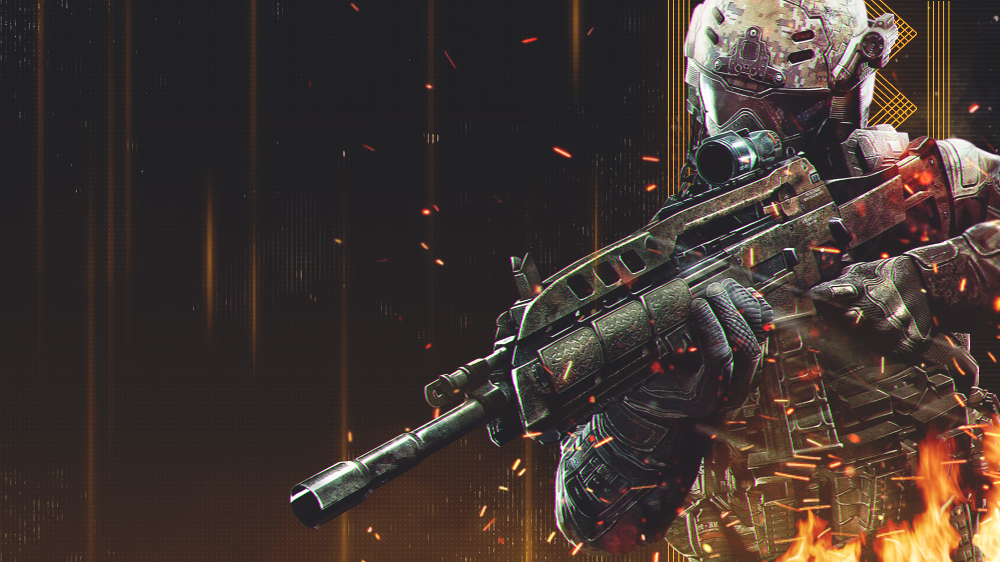

# Plutonium-T6-Scripts

## What is this?

This is a collection of [Plutonium](https://plutonium.pw/docs/intro/) T6/BO2 scripts I created, written in [GSC](https://plutonium.pw/docs/modding/gsc/).  

Huge thanks to everyone who helped me learn GSC: Birchy, DoktorSAS, FutureRave and other people on Discord.

## How do I download a script?

If you are unsure whether you should download a compiled or a source script, first read [What are compiled and source scripts?](#what-are-compiled-and-source-scripts)

### Compiled / Ready to use script

To download a compiled script, click on a `.gsc` file that **doesn't** end with `-source` and click on `Download`.

  
Image

  
  
  

  

### Source script

Alternatively, if you want to download the source code click on a `.gsc` file that ends with `-source` and click on `Raw`.

  
Image

  
  
  

Right click anywhere and click on `Save page as` (or an equivalent).

Make sure to put `All` or `Any` for the file type and to add `.gsc` at the end of the file name.

  
Image

  
  

## How do I use a compiled script?

[Follow the instructions in the documentation](https://plutonium.pw/docs/modding/loading-mods/#loading-existing-scripts-on-t6)

If the script should be loaded for both the multiplayer and the zombies mode then drop the file in `%localappdata%\Plutonium\storage\t6\scripts`
If the script should only be loaded for the multiplayer mode then put it in the `mp` folder.  
If the script should only be loaded for the zombies mode then put it in the `zm` folder.  

Note that you can use `map_restart` in the [console](https://plutonium.pw/docs/opening-console/) to quickly restart your current game and reload scripts.

## How do I compile a script?

<!---
Replace with Plutonium's documentation instead when it's up-to-date
--->

- Download [GSC Tool](https://github.com/xensik/gsc-tool/releases/latest)
- Read the [instructions to compile a file](https://github.com/xensik/gsc-tool#usage)

It should look similar to this  
`gsc-tool.exe comp t6 "C:\Users\Resxt\AppData\Local\Plutonium\storage\t6\scripts\mapvote.gsc"`  

If after opening the file you see that it has a lot of non readable characters this means that it was successfully compiled.

## What are compiled and source scripts?

Before downloading a script it's important to understand what compiled and source scripts mean.  
A source script is the script in a human readable form (a text file), this is how the script is written.  
A compiled script is simply a source script that has been compiled by an interpreter to make it readable by the game.  
At the time of writing, T6 cannot read source scripts so you have to compile them to allow the game to read them.

So if you only want to use a script and you don't want to edit a script or review its code then  
you can simply [download a compiled script](#compiled--ready-to-use-script) and [start using it](#how-do-i-use-a-compiled-script).

All of my scripts always come as two files:

- script.gsc (compiled script)
- script-source.gsc (source script)
