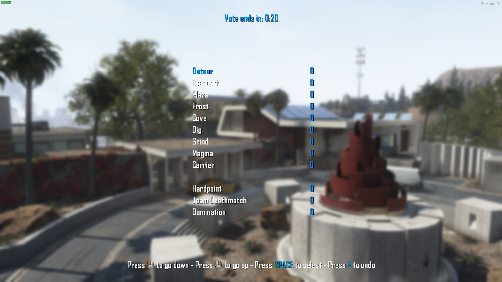
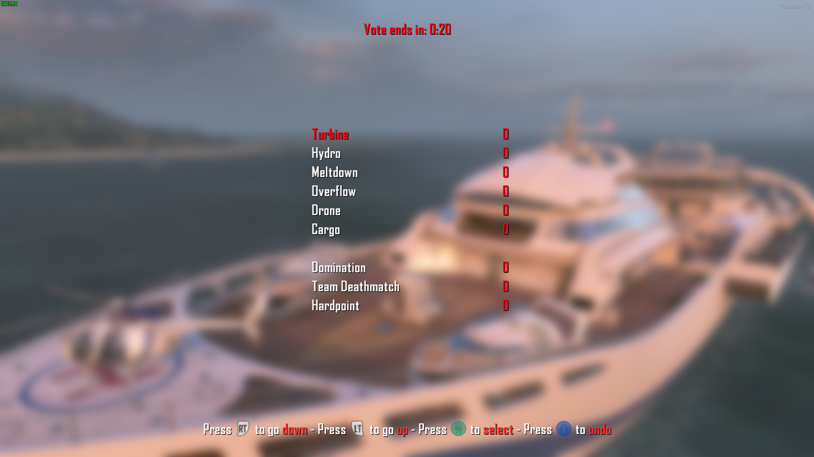

# Mapvote

A customizable mapvote script for both multiplayer and zombies.  

Note that this only works for dedicated servers.  
You can still run the script in a private match to get a preview of the menu and configure it the way you like before using it on your server but it won't rotate to your chosen map/mode due to a technical limitation the game has.  

This is heavily inspired by [LastDemon99's IW5 mapvote](https://github.com/LastDemon99/IW5_VoteSystem).  
I also re-used some code from [DoktorSAS T6 mapvote](https://github.com/DoktorSAS/PlutoniumT6Mapvote).  
Huge thanks to both of them.


*Multiplayer mode. Mouse and keyboard input. Changed settings: limits modes: 3, horizontal spacing: 100*


*Zombies mode. Controller input. Changed settings: red colors, accent mode: max*

## mapvote.gsc

This script can be installed in any folder depending on what you want to do.  
The recommended solution is to just install it in the `scripts` folder so that it will work out of the box for both mp and zm.  
Since it's disabled by default it won't affect your servers or run unless you enable it so it's safe to have it in the `scripts` folder.

**[IMPORTANT]** Installing `mapvote_mp_extend.gsc` in `scripts\mp` is **mandatory** to make the mapvote work normally in multiplayer.  
**[IMPORTANT]** Installing `mapvote_zm_extend.gsc` in `scripts\zm` is **mandatory** to make the mapvote work normally in zombies.

### Main features

- It allows up to 12 elements (maps + modes) to be displayed on screen
- You can configure how much maps and modes you want on screen
- It will automatically adapt the amount of elements to display if you don't choose a fixed amount of maps/modes to show
- It has separate map and mode choices for multiplayer
- It supports custom CFG
- It supports custom gamemode names in multiplayer and custom map names in zombies
- It rotates a random map from the list when there are no votes for maps. Same applies for modes in multiplayer too
- You can choose to rotate a random map and mode from a list you define when the human players count is between a min and max values you define (disabled by default)
- Controllers are fully supported and work out of the box
- It has a good level of customization
- It has a debug mode to quickly preview the menu and print some values in the console

### Getting started

To configure the menu before putting it on your server I recommend running it in a custom game with the `mapvote_debug` dvar set to `1`.  
To do that use this command in the console `set mapvote_debug 1` before running a custom game.  
Start a custom game and you will see the menu. Everything will work but map rotation which is normal.  
You can then configure the dvars directly in your console and restart the map with `map_restart` in the console to edit the menu quickly and get your perfect setup.

Note that by default the mapvote will be activated on all of your servers.  
If you run multiple servers and want it off on certain servers you will need to add `set mapvote_enable 0` in the server's CFG.

### Dvars

Here are the dvars you can configure:

<details>
  <summary>Multiplayer dvars</summary>
  
  | Name | Description | Default value | Accepted values |
|---|---|---|---|
| mapvote_enable | Toggle whether the mapvote is activated or not. 0 is off and 1 is on | 1 | 0 or 1 |
| mapvote_debug | Toggle whether the mapvote runs in debug mode or not. This will display the mapvote menu a few seconds after starting the game. 0 is off and 1 is on | 0 | 0 or 1 |
| mapvote_maps | A list of the maps that are available for rotation | Every maps including DLC maps | Any map name. Each map is separated with a colon (:) |
| mapvote_modes | A list of the modes that are available for rotation. The first parameter is how the mode will be displayed, it can be set to anything you like, the second parameter is the name of the cfg file to load | "Team Deathmatch,tdm:Domination,dom:Hardpoint,koth" | Any text followed by a comma (,) and then the cfg name. Each block is separated with a colon (:) |
| mapvote_limits_maps | The amount of maps to display. 0 will handle it automatically | 0 | Any plain number from 0 to `mapvote_limits_max` |
| mapvote_limits_modes | The amount of modes to display. 0 will handle it automatically | 0 | Any plain number from 0 to `mapvote_limits_max` |
| mapvote_limits_max | The maximum amount of elements to display (maps + modes) | 12 | 2, 4, 6, 8, 10, 12 |
| mapvote_colors_selected | The color of the text when hovered or selected. This is also the color of the votes count | blue | red, green, yellow, blue, cyan, purple, white, grey, gray, black |
| mapvote_colors_unselected | The color of the text when not hovered and not selected | white | red, green, yellow, blue, cyan, purple, white, grey, gray, black |
| mapvote_colors_timer | The color of the timer as long as it has more than 5 seconds remaining | blue | red, green, yellow, blue, cyan, purple, white, grey, gray, black |
| mapvote_colors_timer_low | The color of the timer when it has 5 or less seconds remaining | red | red, green, yellow, blue, cyan, purple, white, grey, gray, black |
| mapvote_colors_help_text | The color of the help text at the bottom explaining how to use the menu | white | red, green, yellow, blue, cyan, purple, white, grey, gray, black |
| mapvote_colors_help_accent | The color of the accented text of the help text at the bottom | blue | red, green, yellow, blue, cyan, purple, white, grey, gray, black |
| mapvote_colors_help_accent_mode | The accenting mode for the help text. `standard` only puts the accent color on the button to press and `max` puts it on both the buttons and the action it does | standard | standard or max |
| mapvote_sounds_menu_enabled | Toggle whether the mapvote menu sounds are enabled or not. 0 is off and 1 is on | 1 | 0 or 1 |
| mapvote_sounds_timer_enabled | Toggle whether the timer will start making a beeping sound every second when there's 5 or less seconds remaining to vote or not. 0 is off and 1 is on | 1 | 0 or 1 |
| mapvote_vote_time | The time the vote lasts (in seconds) | 30 | Any plain number above 5 |
| mapvote_blur_level | The amount of blur to put when the mapvote menu starts to show. The max recommended value is 5. 0 disables it | 2.5 | Any number |
| mapvote_blur_fade_in_time | The time (in seconds) it takes for the blur to reach `mapvote_blur_level`. For example if you set it to 10 and `mapvote_blur_level` is 5 then it will progressively blur the screen from 0 to 5 in 10 seconds | 2 | Any number |
| mapvote_horizontal_spacing | The horizontal spacing between the map/mode names on the left and the vote counts on the right. I recommend setting this value according to the longest map or mode name length so that it doesn't overlap with the vote counts | 75 | Any plain number |
| mapvote_display_wait_time | Once the killcam ends, the time to wait before displaying the vote menu (in seconds) | 1 | Any number superior or equal to 0.05 |
| mapvote_default_rotation_enable | Toggle whether the default rotation system is activated or not. This allows you to have one or more map(s) and mode(s) rotate by default when the human player count is between `mapvote_default_rotation_min_players` and `mapvote_default_rotation_max_players` (inclusive). 0 is off and 1 is on | 0 | 0 or 1 |
| mapvote_default_rotation_maps | A list of the maps that are available for default rotation | "Hijacked:Raid:Nuketown" | Any map name. Each map is separated with a colon (:) |
| mapvote_default_rotation_modes  | A list of the modes that are available for default rotation. It needs to be the name of a CFG file | "tdm" | Any cfg file name. Each cfg file name is separated with a colon (:) |
| mapvote_default_rotation_min_players | The minimum amount of human players required to rotate the default rotation instead of showing the mapvote. If the human players count is smaller than this then it will display the mapvote | 0 | Any plain number from 0 to 18 |
| mapvote_default_rotation_max_players | The maximum amount of human players required to rotate the default rotation instead of showing the mapvote. If the human players count is higher than this then it will display the mapvote | 0 | Any plain number from 0 to 18 |
  
</details>

<details>
  <summary>Zombies dvars</summary>
  
  | Name | Description | Default value | Accepted values |
|---|---|---|---|
| mapvote_enable | Toggle whether the mapvote is activated or not. 0 is off and 1 is on | 1 | 0 or 1 |
| mapvote_debug | Toggle whether the mapvote runs in debug mode or not. This will display the mapvote menu a few seconds after starting the game. 0 is off and 1 is on | 0 | 0 or 1 |
| mapvote_maps | A list of the maps that are available for rotation, including how you want to display it and which CFG to load | All survival/classic maps but Tranzit including DLC maps | Any text followed by a comma (,) with then the map name followed by a comma (,) and finally the CFG file name. Each block is separated with a colon (:) |
| mapvote_limits_max | The maximum amount of maps to display | 12 | Any plain number from 2 to 12 |
| mapvote_colors_selected | The color of the text when hovered or selected. This is also the color of the votes count | blue | red, green, yellow, blue, cyan, purple, white, grey, gray, black |
| mapvote_colors_unselected | The color of the text when not hovered and not selected | white | red, green, yellow, blue, cyan, purple, white, grey, gray, black |
| mapvote_colors_timer | The color of the timer as long as it has more than 5 seconds remaining | blue | red, green, yellow, blue, cyan, purple, white, grey, gray, black |
| mapvote_colors_timer_low | The color of the timer when it has 5 or less seconds remaining | red | red, green, yellow, blue, cyan, purple, white, grey, gray, black |
| mapvote_colors_help_text | The color of the help text at the bottom explaining how to use the menu | white | red, green, yellow, blue, cyan, purple, white, grey, gray, black |
| mapvote_colors_help_accent | The color of the accented text of the help text at the bottom | blue | red, green, yellow, blue, cyan, purple, white, grey, gray, black |
| mapvote_colors_help_accent_mode | The accenting mode for the help text. `standard` only puts the accent color on the button to press and `max` puts it on both the buttons and the action it does | standard | standard or max |
| mapvote_vote_time | The time the vote lasts (in seconds) | 30 | Any plain number above 5 |
| mapvote_blur_level | The amount of blur to put when the mapvote menu starts to show. The max recommended value is 5. 0 disables it | 2.5 | Any number |
| mapvote_blur_fade_in_time | The time (in seconds) it takes for the blur to reach `mapvote_blur_level`. For example if you set it to 10 and `mapvote_blur_level` is 5 then it will progressively blur the screen from 0 to 5 in 10 seconds | 2 | Any number |
| mapvote_horizontal_spacing | The horizontal spacing between the map names on the left and the vote counts on the right. I recommend setting this value according to the longest map name length so that it doesn't overlap with the vote counts | 75 | Any plain number |
| mapvote_display_wait_time | Once the game over screen ends, the time to wait before displaying the vote menu (in seconds) | 1 | Any number above 0.05 |
| mapvote_default_rotation_enable | Toggle whether the default rotation system is activated or not. This allows you to have one or more map(s) and mode(s) rotate by default when the human player count is between `mapvote_default_rotation_min_players` and `mapvote_default_rotation_max_players` (inclusive). 0 is off and 1 is on | 0 | 0 or 1 |
| mapvote_default_rotation_maps | A list of the maps that are available for default rotation | "Town,zm_standard_town:Farm,zm_standard_farm" | The map name followed by a comma (,) and then the CFG file name. Each block is separated with a colon (:) |
| mapvote_default_rotation_min_players | The minimum amount of human players required to rotate the default rotation instead of showing the mapvote. If the human players count is smaller than this then it will display the mapvote | 0 | Any plain number from 0 to 18 |
| mapvote_default_rotation_max_players | The maximum amount of human players required to rotate the default rotation instead of showing the mapvote. If the human players count is higher than this then it will display the mapvote | 0 | Any plain number from 0 to 18 |
  
</details>

### Configuration

Below is an example CFG showing how each dvars can be configured.  
The values you see are the default values that will be used if you don't set a dvar.  

<details>
  <summary>Multiplayer CFG</summary>

  ```c
set mapvote_enable 1
set mapvote_maps "Aftermath:Cargo:Carrier:Drone:Express:Hijacked:Meltdown:Overflow:Plaza:Raid:Slums:Standoff:Turbine:Yemen:Nuketown:Downhill:Mirage:Hydro:Grind:Encore:Magma:Vertigo:Studio:Uplink:Detour:Cove:Rush:Dig:Frost:Pod:Takeoff"
set mapvote_modes "Team Deathmatch,tdm:Domination,dom:Hardpoint,koth"
set mapvote_limits_maps 0
set mapvote_limits_modes 0
set mapvote_limits_max 12
set mapvote_colors_selected "blue"
set mapvote_colors_unselected "white"
set mapvote_colors_timer "blue"
set mapvote_colors_timer_low "red"
set mapvote_colors_help_text "white"
set mapvote_colors_help_accent "blue"
set mapvote_colors_help_accent_mode "standard"
set mapvote_sounds_menu_enabled 1
set mapvote_sounds_timer_enabled 1
set mapvote_vote_time 30
set mapvote_blur_level 2.5
set mapvote_blur_fade_in_time 2
set mapvote_horizontal_spacing 75
set mapvote_display_wait_time 1
set mapvote_default_rotation_enable 0
set mapvote_default_rotation_maps "Hijacked:Raid:Nuketown"
set mapvote_default_rotation_modes "tdm"
set mapvote_default_rotation_min_players 0
set mapvote_default_rotation_max_players 0
```

Here are some pre-set values if you want to quickly copy/paste something

| Description | Value |
|---|---|
| All base game maps | "Aftermath:Cargo:Carrier:Drone:Express:Hijacked:Meltdown:Overflow:Plaza:Raid:Slums:Standoff:Turbine:Yemen" |
| All DLC maps | "Nuketown:Downhill:Mirage:Hydro:Grind:Encore:Magma:Vertigo:Studio:Uplink:Detour:Cove:Rush:Dig:Frost:Pod:Takeoff" |
| Classic modes | "Team Deathmatch,tdm:Domination,dom:Hardpoint,koth" |
| Objective modes | "Demolition,dem:Headquaters,hq:Capture the Flag,ctf" |
| Alternative modes | "Kill Confirmed,conf:One Flag CTF,oneflag" |
| Party modes | "Gun Game,gun:One in the Chamber,oic:Sharpshooter,shrp:Sticks & Stones,sas" |
| FFA 24/7 | "Free for All,dm" |
| SND 24/7 | "Search & Destroy,sd" |

</details>

<details>
  <summary>Zombies CFG</summary>

  ```c
set mapvote_enable 1
set mapvote_maps "Bus Depot,Bus Depot,zm_standard_transit:Town,Town,zm_standard_town:Farm,Farm,zm_standard_farm:Mob of The Dead,Mob of The Dead,zm_classic_prison:Nuketown,Nuketown,zm_standard_nuked:Origins,Origins,zm_classic_tomb:Buried,Buried,zm_classic_processing:Die Rise,Die Rise,zm_classic_rooftop"
set mapvote_limits_max 12
set mapvote_colors_selected "blue"
set mapvote_colors_unselected "white"
set mapvote_colors_timer "blue"
set mapvote_colors_timer_low "red"
set mapvote_colors_help_text "white"
set mapvote_colors_help_accent "blue"
set mapvote_colors_help_accent_mode "standard"
set mapvote_vote_time 30
set mapvote_blur_level 2.5
set mapvote_blur_fade_in_time 2
set mapvote_horizontal_spacing 75
set mapvote_display_wait_time 1
set mapvote_default_rotation_enable 0
set mapvote_default_rotation_maps "Town,zm_standard_town:Farm,zm_standard_farm"
set mapvote_default_rotation_min_players 0
set mapvote_default_rotation_max_players 0
```

Here are some pre-set values if you want to quickly copy/paste something

| Description | Value |
|---|---|
| Tranzit & Tranzit survival maps | "Tranzit,Tranzit,zm_classic_transit:Bus Depot,Bus Depot,zm_standard_transit:Town,Town,zm_standard_town:Farm,Farm,zm_standard_farm" |
| DLC maps | "Buried,Buried,zm_classic_processing:Die Rise,Die Rise,zm_classic_rooftop:Mob of The Dead,Mob of The Dead,zm_classic_prison:Nuketown,Nuketown,zm_standard_nuked:Origins,Origins,zm_classic_tomb" |
| Grief maps | "Buried (Grief),Buried,zm_grief_street:Mob of The Dead (Grief),Mob of The Dead,zm_grief_cellblock:Farm (Grief),Farm,zm_grief_farm:Town (Grief),Town,zm_grief_town:Bus Depot (Grief),Bus Depot,zm_grief_transit" |
| Turned maps | "Buried (Turned),Buried,zm_cleansed_street:Diner (Turned),Diner,zm_cleansed_diner" |

</details>

### Notes

- If right click is set to toggle ads then pressing right click will make the player go up by one every 0.25s until he right clicks again.  
If I didn't change it to be that way players with toggle ads would have to press right click twice to go up by one all the time.  
Now instead they simply right click once to start going up and right click again to stop which is a better user experience.
- When there's only one map/mode, instead of showing a single vote possibility, your single map/mode will be hidden to make the user experience better but it will still always rotate to your one map/mode
- All the sounds (menu and timer) don't work in zombies.  
The game seems to progressively (but quickly) mute the sound during the [intermission phase](https://github.com/plutoniummod/t6-scripts/blob/main/ZM/Core/maps/mp/zombies/_zm.gsc).  
Until I find a way to play sounds in the intermission, if it's even possible, the zombies menu will sadly not have any sound
- If some map/mode names or vote count don't display at all then you probably have other scripts that create HUD elements and there's too much elements to display so either remove your script or lower `mapvote_limits_max` so that the mapvote will have less elements to display
- When two maps/modes have the same votes, the lowest one in the list will win. In the future it would be nice to randomize between both
- Ending the game with ESC doesn't work when in debug mode.  
Use `map_restart` in the console when your script is compiled. And if you want to leave use `disconnect` in the console until this is fixed
- [Zombies++](https://github.com/Paintball/BO2-GSC-Releases/tree/master/Zombies%20Mods/Zombies%2B%2B/v1.2/Source%20Code) will cause conflict with the ZM mapvote but you can easily make them both work without having to remove one.  
Open the `clientids.gsc` file provided by Zombies++ and comment these lines: `368, 504, 505`.  
The part that overrides the end game logic in Zombies++ should no longer interfere with the mapvote.  
Both scripts should work normally after rotating to a new map / restarting the server

## mapvote_mp_extend.gsc

A small script that goes with `mapvote.gsc` to make it work in multiplayer.  
It has to be installed in the `scripts\mp` directory since it contains multiplayer only code.  
Putting it in `scripts` or `scripts\zm` will throw an error when booting up a zombies map.

## mapvote_zm_extend.gsc

A small script that goes with `mapvote.gsc` to make it work in zombies.  
It has to be installed in the `scripts\zm` directory since it contains zombies only code.  
Putting it in `scripts` or `scripts\mp` will throw an error when booting up a multiplayer map.
